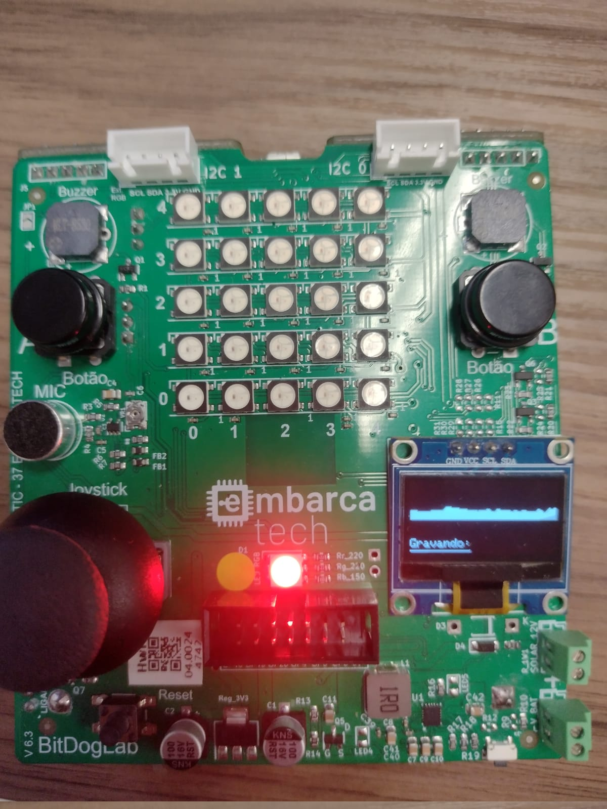
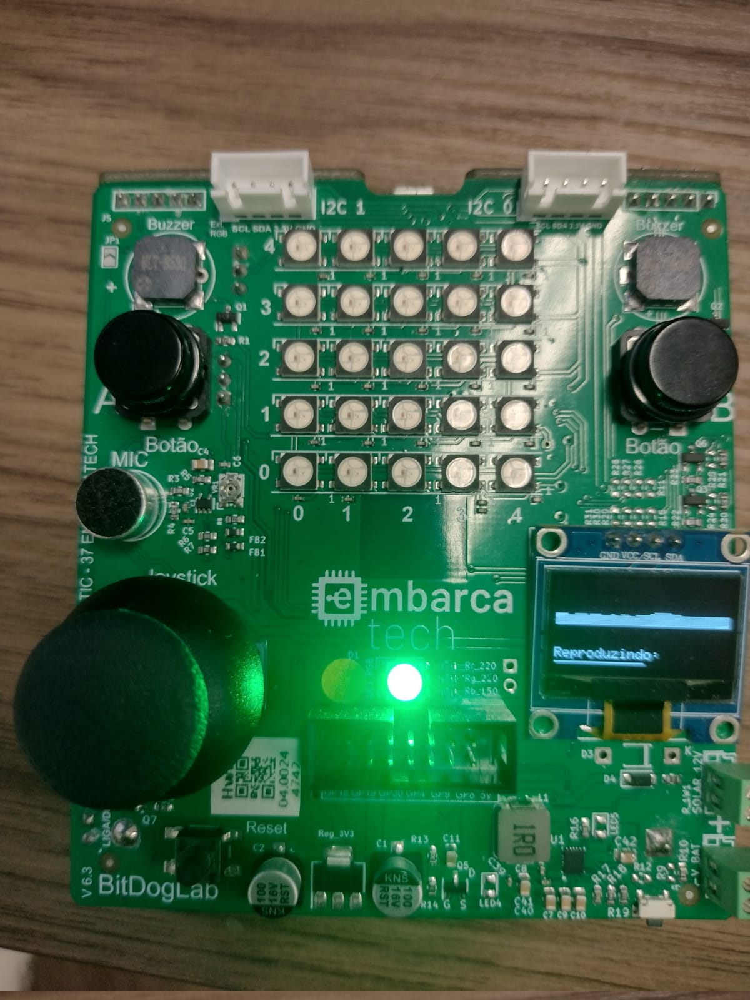

# Projetos de Sistemas Embarcados - EmbarcaTech 2025

Autor: **José Augusto Alves de Moraes**

Curso: Residência Tecnológica em Sistemas Embarcados

Instituição: EmbarcaTech - HBr

Brasília, Junho de 2025

---

## Objetivos

O objetivo deste projeto foi implementar um sintetizador de audio utilizando a BitDogLab.

---

## Componentes Utilizados

Para desenvolver o projeto foram utilizados os seguintes componentes da BitDogLab.

| Componente         | Quantidade | GPIO               |
| ------------------ | ---------- | -------------------|
| Botão              | 2          | 5, 6               |
| Buzzer             | 1          | 21                 |
| Display OLED       | 1          | 14 (SDA), 15 (SDC) |
| LED RGB            | 1          | 11 (G), 13 (R)     |
| Microfone          | 1          | 28                 |

---

## Implementação

### Organização dos diretórios

- src/
  - app/
    - `sintetizador.c` - Arquivo principal do programa utiliza as funções definidas em outros módulos para definir o loop principal.
  - drivers/
    - `ssd1306.c` - Arquivo com as funções baixo nível utilizadas para controlar o display OLED, código tirado do repositório da BitDogLab.
  - hal/
    - `button_handler.c` - Arquivo que define o compartamento dos botões, neste caso foram utilizadas interrupções para controlar o funcionamento do sintetizador.
    - `buzzer_handler.c` - Arquivo que define o funcionamento do buzzer, este módulo consome os dados armazenados pela função do módulo mic_handler, em um buffer, para reproduzir o som.
    - `led_handler.c` - Arquivo que define o funcionamento do LED RGB, que é ativado a depender do estado do sintetizador.
    - `mic_handler.c` - Arquivo que define o funcionamento do microfone, o microfone utiliza uma taxa de amostragem de 8khz e converte o resultado de cada amostra para um valor de 8 bits para ser utilizado no buzzer via pwm.
    - `screen_handler.c` - Arquivo que abstrai as funções do módulo ssd1306 para desenhar na tela OLED.

### Imagens Demonstrativas

---

## Utilização

### Dependêcias

- [Pico C SDK](https://github.com/raspberrypi/pico-sdk)
- [Picotool](https://github.com/raspberrypi/picotool)
- [Just](https://github.com/casey/just)

### Como Compilar e Executar

Para compilar o projeto é possível utilizar a extensão da Pico C SDK ou o terminal, executando o seguinte comando na raiz do projeto.

`cmake -S . -B build -G Ninja && ninja -C build`

Após compilar o projeto basta passar o arquivo para a placa com o comando a seguir:

`sudo picotool load build/src/app/sintetizador.elf`

Caso tenha o [just](https://github.com/casey/just) instalado é possível utilizar os dois comandos a seguir ao invés dos mencionados acima:

`just build`

`just load sintetizador`

---

## 📜 Licença

GNU GPL-3.0.
